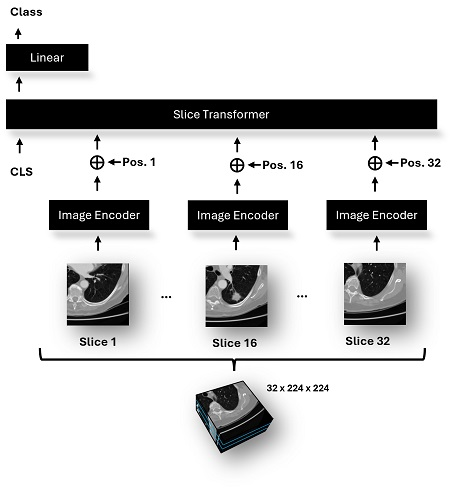

# Medical Slice Transformer: Improved Diagnosis and Explainability on 3D Medical Images with DINOv2 

Please see our paper: 

 
Figure: Visualization of the proposed MST architecture. 

## Step 1: Setup 
* Clone this repository `git clone https://github.com/mueller-franzes/MST`
* Run: `conda env create -f environment.yaml` 
* Run `conda activate MST`

## Step 2: Setup Data
* Add your own dataset to [mst/data/datasets](mst/data/datasets)
* Add your own dataset to `get_dataset()` in [scripts/main_train.py](scripts/main_train.py)  

## Step 3: Run Training
Run Script: [scripts/main_train.py](scripts/main_train.py)
* Eg. `python scripts/main_train.py --dataset LIDC --model ResNet`
* Use `--model` to select:
    * ResNet = 3D ResNet34, 
    * ResNetSliceTrans = MST-ResNet, 
    * DinoV2ClassifierSlice = MST-DINOv2  

## Step 4: Predict & Evaluate Performance
Run Script: [scripts/main_predict.py](scripts/main_predict.py)
* Eg. `python scripts/main_predict.py --run_folder LIDC/ResNet`
* Use `--get_attention` to compute saliency maps
* Use `--get_segmentation` to compute segmentation masks and DICE score 
* Use `--use_tta` to enable Test Time Augmentation 